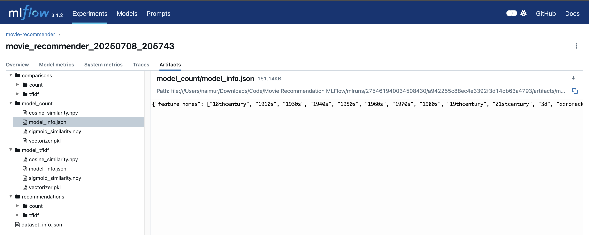
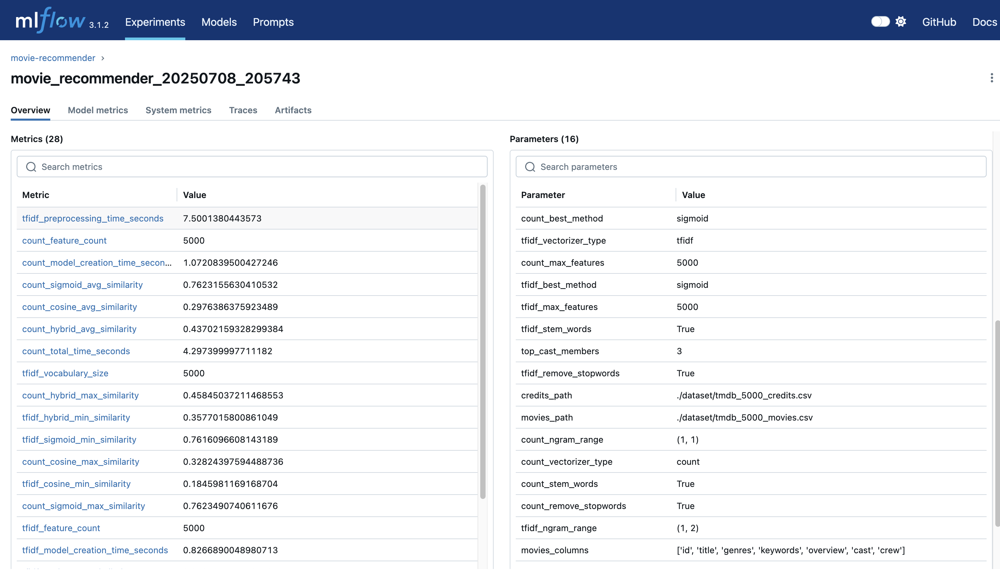
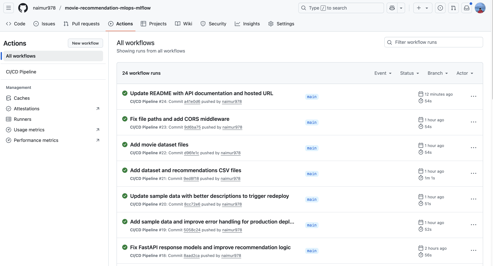

# Movie Recommendation System

A movie recommendation system built with MLOps practices, incorporating machine learning, MLFlow, CI/CD, API development.

## Overview

This project demonstrates an MLOps pipeline for a movie recommendation system that uses content-based filtering with cosine similarity. The system analyzes movie features like genres, cast, director, and keywords to suggest similar movies to users.

### Recommendation Algorithm

The system uses a content-based filtering approach:
1. **Feature Engineering**: 
   - Combines movie metadata (genres, keywords, cast, director)
   - Processes text using Porter Stemming for normalization
   - Creates a rich feature vector for each movie

2. **Vectorization**:
   - Uses CountVectorizer to convert text features into numerical format
   - Applies TF-IDF transformation to account for feature importance

3. **Similarity Computation**:
   - Calculates cosine similarity between all movies
   - Creates a precomputed similarity matrix for fast recommendations
   - Ranks similar movies based on similarity scores


## Project Implementation

The project implements a complete MLOps pipeline:
- Content-based recommendation engine using TMDB dataset
- MLflow for experiment tracking and model management
- FastAPI for creating a production-ready REST API
- Deployed on Render with CI/CD integration

## Live Demo

🚀 **Try it out:** [Movie Recommendation API](https://movie-recommendation-mlops-mlflow.onrender.com)

Check out these endpoints:
- 🎬 Movie Recommendations: [Try with the movie Avatar](https://movie-recommendation-mlops-mlflow.onrender.com/recommend?movie_title=Avatar&num_recommendations=5)
- 📋 Browse Movies: [View Movie List](https://movie-recommendation-mlops-mlflow.onrender.com/movies?limit=10&skip=0)
- ❤️ Health Check: [API Status](https://movie-recommendation-mlops-mlflow.onrender.com/health)


## Technology Stack

### Data Science & ML
- **Python 3.9+**: Core programming language
- **Pandas & NumPy**: Data manipulation and numerical operations
- **Scikit-learn**: Machine learning tools
  - CountVectorizer for text processing
  - Cosine similarity for recommendations
- **NLTK**: Natural language processing
  - Porter Stemming for text normalization

### MLOps
- **MLflow**: ML lifecycle management
  - Experiment tracking
  - Model versioning
  - Parameter logging
  - Metric monitoring
  - Artifact management

### Web API
- **FastAPI**: Modern, fast web framework
  - Automatic API documentation
  - Type checking and validation
  - High performance
  - Easy deployment
- **Pydantic**: Data validation using Python type annotations

### Deployment
- **Render**: Cloud platform for deployment
- **Git**: Version control
- **GitHub Actions**: CI/CD pipeline

## Project Screenshots


The project includes three key screenshots:


*MLflow experiment tracking dashboard: shows experiment runs, parameters, and metrics for the movie recommendation models.*


*MLflow artifact and model management: displays logged artifacts, model versions, and additional experiment details.*


*CI/CD pipeline: illustrates the automated testing and deployment workflow for the project.*

## Setup

1. Clone the repository:
   ```bash
   git clone https://github.com/naimur978/movie-recommendation-mlops-mlflow.git
   cd movie-recommendation-mlops-mlflow
   ```

2. Create and activate virtual environment:
   ```bash
   python -m venv .venv
   source .venv/bin/activate  # On Windows: .venv\Scriptsctivate
   ```

3. Install dependencies:
   ```bash
   pip install pandas numpy scikit-learn nltk mlflow
   ```

4. Download the TMDB dataset and place in `dataset/` folder:
   - tmdb_5000_movies.csv
   - tmdb_5000_credits.csv

## Usage

Run the recommendation system:
```bash
python movie-recommender-using-vectorization.py
```

View MLflow UI:
```bash
mlflow ui
```

## MLflow Tracking

The project tracks:
- Dataset parameters
- Model parameters (max_features, vectorizer type)
- Processing times
- Feature statistics
- Model artifacts
- Recommendation metrics

## Project Structure

```
├── dataset/                # Data files
│   ├── tmdb_5000_movies.csv
│   ├── tmdb_5000_credits.csv
│   └── count_cosine_recommendations.csv
├── images/               # Documentation screenshots
│   ├── SS1.png              # API documentation interface
│   ├── SS2.png              # Example recommendations
│   └── SS3.png              # MLflow tracking dashboard
├── models/               # Saved models
├── artifacts/           # MLflow artifacts
├── app.py              # FastAPI application
├── movie-recommender-using-vectorization.ipynb
├── requirements.txt
├── README.md
└── .gitignore
```

## Features Implemented

1. **Data Processing**
   - Movie content feature extraction
   - Text preprocessing and vectorization
   - Similarity matrix computation

2. **Machine Learning**
   - Content-based recommendation system
   - Model experimentation and tracking
   - Performance metrics logging

3. **API Development**
   - RESTful endpoints
   - Request validation
   - Error handling
   - Response models
   - API documentation

4. **MLOps**
   - Experiment tracking
   - Model versioning
   - Parameter logging
   - Metric monitoring

5. **Deployment**
   - Cloud deployment
   - Environment configuration
   - Error logging
   - Performance monitoring

